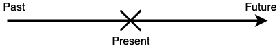
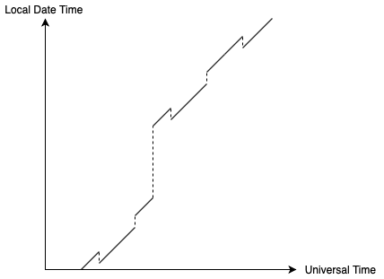

# Independent Research Project - How Should Programmers Beat the Time and Seize the Day?

I will discuss how we, as programmers, should handle dates and times, both mentally, and in production code.

## Contents

- [Scope of this project](#scope-of-this-project)
- [Why should we care?](#why-should-we-care)
    - [The Millennium Bug](#the-millennium-bug)
    - [New Japanese Era](#new-japanese-era)
    - [Google Calendar in Brazil](#google-calendar-in-brazil)
    - [EZDiary timezone bug](#ezdiary-timezone-bug)
- [A model for timezones](#a-model-for-timezones)
    - [The Timezone Function](#the-timezone-function)
    - [The Difference Between "Timezone" and "Time Zone"](#the-difference-between-timezone-and-time-zone)
    - [Daylight Saving Time and Other Changes in Offset](#daylight-saving-time-and-other-changes-in-offset)
    - [Revisiting Google Calendar](#revisiting-google-calendar)
    - [Revisiting EZDiary](#revisiting-ezdiary)
- [Case Study 1 - `java.util.Date` and `java.util.Calendar`](#case-study-1---java.util.date-and-java.util.calendar)
    - [`Date` In JDK 1.0 - An Abomination](#date-in-jdk-1.0---an-abomination)
    - [`Calendar` And Others In JDK 1.1 - Better But Not Good Enough](#calendar-and-others-in-jdk-1.1---better-but-not-good-enough)
    - [Mutability and Threading](#mutability-and-threading)
    - [The JSR](#the-jsr)
- [Case Study 2 - The `java.time` API](#case-study-2---the-java.time-api)
    - [A Myriad of Classes](#a-myriad-of-classes)
    - [A Myriad of Interfaces](#a-myriad-of-interfaces)
    - [Parallels with The Model for Time Zones](#parallels-with-the-model-for-time-zones)
- [Answering a Stack Overflow Question](#answering-a-stack-overflow-question)
- [Conclusion](#conclusion)
- [Further Research](#further-research)
- [Bibliography](#bibliography)

## Scope of this project

I will ignore relativistic effects such as time dilation due to travelling at a very high speed, because only few programmers, such as those who write code for satellite clocks, need to put that into consideration. In our everyday lives, no computer would be travelling at relativistic speeds.

I will also ignore leap seconds, as they add unnecessary complexity. [There are few applications where leap seconds matter anyway](https://www.joda.org/joda-time/faq.html#leapseconds), and [the common dates and times APIs do not support leap second either](https://stackoverflow.com/a/30989049/5133585).

Unless specified, all Swift code is written in Swift 4.2, and all Java code is written in Java 8.

## Why should we care?

Handling dates and times correctly is very important when developing software. If not done properly, this could lead to really hard-to-trace bugs, or even catastrophic effects. Here are a few examples of bugs caused by handling dates and times wrongly.

### The Millennium Bug

A few dozen years ago, [the year component of a date is usually stored as a 2 digit number](https://www.nationalgeographic.org/encyclopedia/Y2K-bug/) instead of the full four digits to save as much memory as possible. This is especially true in embedded systems like elevators and thermostats, where memory is even more limited. As a result, the year 1987 would be represented as 87, for example. However,  a representation like this does not differentiate between years that are 100 years apart, such as 1901 and 2001, which are both represented as 01.

Depending on the implementation, on the first day of 2000, the computers might display the year as 1900 (99 wraps back to 0) again, or 19100 (99 increments to 100 and is directly concatenated to the string "19"), or some other kind of undocumented behaviour. Many predicted that there would be chaos on 1 January 2000 because of this. This called the Millennium Bug or the Y2K bug.

Fortunately, [developers had worked very hard and fixed most of the critical bugs before the new year, and the effects of this bug was mild](https://www.huffingtonpost.co.uk/entry/millennium-bug-brexit-comparison_uk_5b683c06e4b0fd5c73db9c11). One of the most significant thing that happened was just that a [radiation monitoring team failed](https://pandorafms.com/blog/y2k/) in Ishikawa, Japan.

Although the Millennium Bug did not cause any long-lasting effects, it did teach us a lesson - **Store years in its fullest form, don't shorten it.** As you will see shortly in the case studies, this is exactly what `java.util.Calendar` and `java.time` did.

### New Japanese Era

Although the Japanese use the Gregorian calendar just like the west, they also use their own Japanese calendar system. The only difference is that the Japanese system numbers years differently. [Years are numbered within regnal eras.](https://en.wikipedia.org/wiki/Japanese_calendar#Years) Each reign is a different era and is given a different _gengō_ (era name).

In fact, dates are almost always written in the Japanese calendar system in official documents. For example, in this [driving license](https://popo3.jp/wp-content/uploads/2017/09/IMG_7948_2-1.jpg), the expiry date is written as 平成29年10月8日 (8 October, Heisei 29), where "平成 (Heisei)" is the gengō of the reign of Akihito. Heisei 29 then means the 29th year of Akihito's reign, which is the year 2017 in the Gregorian calendar. The following table shows some more gengō and their corresponding Gregorian calendar years ([source](https://ja.wikipedia.org/wiki/元号一覧_(日本)#近代・現代)).

|Gengō|Gregorian Calendar Years|
|--|--|
|明治 (Meiji)| 1868-1912 |
|大正 (Taishō)|1912-1926|
|昭和 (Shōwa)|1926-1989|
|平成 (Heisei)|1989-2019|
|令和 (Reiwa)|2019 - (current)|

On 1 May 2019, the Japanese era changed from Heisei (平成) to Reiwa (令和), because Naruhito ascended the throne as the new emperor. This change meant that all the years after 1 May 2019 must be reformatted as "令和X年", as opposed to "平成X年". 2019 would be 令和1年 or 令和元年 ("元" meaning "the first") However, the name of the new era was announced only a month before the change, and possibly because of this, many developers were not able to update their software systems in time, causing various bugs including:

- ["31", instead of "1" or "元" was printed on this water bill in the "year" field](https://tech.nikkeibp.co.jp/atcl/nxt/column/18/00735/050800004/)
- [National health insurance cards could not be issued](https://www.sankei.com/politics/news/190507/plt1905070033-n1.html)
- [When depositing money using an ATM, it shows the date of deposit as some day in the year 1989](https://twitter.com/RIORAO/status/1122463333695627266)

The last issue is probably caused by storing the year as a Heisei year, and rolling back to 1 at the end of the era. The developers probably forgot to also store the era name, which meant that the software will interpret a value of 1 as Heisei 1, which is 1989, resulting in the wrong formatting shown. In fact, [this behaviour is observed in many banks, including Hokkaido Bank, Hokuriku Bank, and Bank of Yokohama](https://www.msn.com/ja-jp/money/news/改元前にコンビニatmで誤表記-道銀など、画面に「1989年」/ar-BBWoiB9).

[Microsoft tried to fix this problem in Excel but the first patch they released caused Excel to be unable to be launched.](https://internet.watch.impress.co.jp/docs/yajiuma/1160935.html)

This incident (and the Millennium Bug) just shows how much thought we need to put in when we are designing systems. **We need to be extra careful and think about what might change in the future.** This is especially true for systems involving dates and times, because they seem so simple that are often overlooked. Many Japanese developers did not think that the old Emperor Akihito would abdicate so quickly, and thought the Heisei era would go on for a few more dozen years, which was why they designed a less flexible system and did not manage to update it in time.

### Google Calendar in Brazil

According to [this talk by Jon Skeet](https://youtu.be/l3nPJ-yK-LU?t=2403), who worked on Google Calendar, there was a bug in Google Calendar that was only observed in Brazil. The bug was caused by storing the start and end time of a full day event as 00:00 of that day and 00:00 of the next day respectively. Although this seemed totally reasonable on first sight, this caused a crash in Brazil because Brazil used to go into daylight saving time at 00:00. This meant that clocks go 23:59:59, then the next second is 01:00:00 - the time 00:00:00 does not exist. As a result, trying to parse the time of 00:00 in the local timezone of Brazil caused an exception to be thrown.

[Note that Brazil no longer observes DST at the time of this writing.](https://www.timeanddate.com/news/time/brazil-scraps-dst.html)

When we say "00:00", we don't actually **mean** 00:00 the time. We mean the _start of the day_. For most timezones, this would be the same as the time 00:00, but in Brazil, on the day of transitioning into DST, it would be 01:00. To handle this, we would need to write a function that takes a date and returns a time that marks the start of that day. This is very similar to the `LocalDate.atStartOfDay(ZoneID)` method in `java.time`, which will be discussed in more detail in the second case study.

In general, **we should never assume that any local time exists**, because there might be somewhere in the world that uses that time as the daylight saving time transition, or has a transition across that time. The `atStartOfDay` function solves this problem because it essentially checks whether that time exists or not, and returns a value based on the check.

### EZDiary timezone bug

In the iOS app "[EZDiary](https://apps.apple.com/us/app/ezdiary-my-diary/id1128083826)", which is a diary app, there used to be a time-zone related bug. When the user travels to another timezone, all the entries that the user has written in the original timezone will disappear. When the user travels back however, they re-appear.

After examining the [source code](https://github.com/Sweeper777/PocketDiary) (note that the repository's name is different from the display name on the App Store, and you may have to go back to a previous commit to see the code with the bug.), I realised where the problem was. When saving a diary entry, the developer gets the current `Date` and truncates off the time part (making the time component represent the start of that day), and uses the resulting `Date` as the date of the entry. The [`FSCalendar`](https://github.com/WenchaoD/FSCalendar) API uses the following delegate method to determine how many dots should be shown on a particular date (the app shows one dot to represent that there is a diary entry on that day):

```swift
// Swift 2
func calendar(calendar: FSCalendar, numberOfEventsForDate date: NSDate) -> Int {
    return entries[date] != nil ? 1 : 0
}
```

The developer implemented the method as shown. He was trying to use the `date` parameter to access a dictionary called `entries` containing the dates of the saved diary entries (which are time-truncated) as keys and the diary entries on those days as values. Since `FSCalendar` passes in time-truncated `Date`s as well, this works well, as long as you are in one timezone, that is.

The bug is probably partly due to the developer's misunderstanding of what a `Date` object represents. A `Date` object represents a single point in time, as per the [documentation](https://developer.apple.com/documentation/foundation/date):

> A `Date` value encapsulate a single point in time, independent of any particular calendrical system or time zone.

Therefore, when we truncate the time component, the resulting `Date` is only time-truncated **in the local timezone** and any timezones with the same offset at the that time. I will explain why that is in the next section, so don't worry that is not immediately obvious. When the user goes to another timezone with a different offset, the saved time is still time-truncated in the old timezone, but the dates that `FSCalendar` is passing in are time-truncated in the new timezone. This means that the saved date and the `date` parameter would never be the same, so the `entries` dictionary will never contain any of the `date` parameters passed in, causing the method to always return 0. Hence, all the diary entries appear to disappear.

When we are storing dates and times, we must think carefully about what information we actually need, and **store only those values that we need and nothing more**. In this case, the only things that mattered to us is the year, month, and day of the date at which the entry was created, so we should have stored the date in a data structure that encapsulates only those three things. Then in the delegate method, we will have no choice but to extract the year, month, day from the `date` parameter, and use those three values to access the dictionary instead.

----

As seen from the previous two examples, working with timezones in code can be confusing. For some people, even working with them outside the context of software engineering is a pain. Therefore, we really need a way to think about them effectively. Here, I will present a model for this purpose, and programmers should use this when dealing with timezones, because this can be used to create a good visualisation of what they are doing.

## A model for timezones

(Note that this model is only intended for a better **mental** understanding of timezones, and as a useful tool for finding logical errors in timezone-related code by visualising time zones themselves. It does not necessarily reflect how timezones are actually represented in computer systems. This model is based on the idea mentioned in [this talk by Jon Skeet](https://youtu.be/saeKBuPewcU?t=1195).)

Since we are ignoring relativistic effects, time is absolute for everyone and it can be said that there is an "universal time line", similar to the real number line. Every point in time (past, present, future) lies. 



We are travelling on this line at a rate of 1 second per second, always. All the points on this line form the set of all points in time $U$ (for **u**niversal time line). Note the the elements of $U$ are _points in time_, not tuples of years, months, days, hours, minutes, seconds, and milliseconds. The values of year, month and day would depend on the calendar system, and the values of hour and minute would depend on the timezone we use. Timezones and calendar systems are man-made ideas, so a tuple of these values would not be suitable to represent such a fundamental concept as a "point in time".

A point in time can be thought of as a real number. It is $x$ seconds since some arbitrarily defined epoch ($x \in ℝ$). A negative $x$ would represent a point in time before the epoch. This can be useful when we want to plot a graph, which we will do in a moment.

If we are in a timezone, there would be the concept of _local date times_. A local date time is a tuple of a date, hours $h \in ℤ, h \in [0,24)$, minutes $m \in ℤ, m \in [0,60)$, seconds $s \in ℤ, s \in [0,60)$ and milliseconds $S \in ℝ, S \in [0,1000)$. The date can be represented in any calendar system. The calendar system does not quite matter for the purpose of understanding timezones. I will format local date times using the Gregorian Calendar for the rest of this document. This paragraph from [Jon Skeet's NodaTime blog post](https://blog.nodatime.org/2011/08/what-wrong-with-datetime-anyway.html) explains the difference between points in time (which he calls an "instants") and local date times (which he calls "local date and times"):

> A local date and time isn't tied to any particular time zone. At this moment, is it before or after "10pm on August 20th 2011"? It depends where you are in the world. (I'm leaving aside any non-ISO calendar representations for the moment, by the way.) So a `DateTimeOffset` contains a time-zone-independent component (that "10pm on ..." part) but also an offset from UTC - which means it can be converted to an _instant_ on what I think of as the time line. Ignoring relativity, everyone on the planet experiences a a particular instant simultaneously. If I click my fingers (infinitely quickly!) then any particular event in the universe happened _before_ that instant, _at_ that instant or _after_ that instant. Whether you were in a particular time zone or not is irrelevant. In that respect instants are _global_ compared to the _local_ date and time which any particular individual may have observed at a particular instant.

Two local date times are equal if and only if their dates represent the same day, and their hours, minutes, seconds, and milliseconds are all equal.

Let $L$ be the set of all local date times. A sentence like this should make quite a lot of sense now.

> At the point in time $u \in U$, the local date time in New York is $\ell_1 \in L$, and the local date time in Hong Kong is $\ell_2 \in L$.

By reading the above statement, you might have realised that different timezones seem to transform an element in $U$ to different elements in $L$, which is exactly what this model of timezones is about.

### The Timezone Function

***In essence, a timezone can be modelled as a function that transforms a point in time to a local date time.*** I call this the _timezone function_ $T$:

$$
T : U \rightarrow L
$$

Although we have defined what a Universal Time of 0 means (the point in time at which the epoch occurs, i.e. 0 seconds since the epoch), we have not defined what a local date time of 0 is. By defining this, we will be able to put the elements of $L$ onto a line too. It should be obvious, by common sense, what should go on both sides of the local date time of 0, given that that the local date time of 0 is defined.

I define the local date time of 0 as the local date time in the timezone [UTC](https://en.wikipedia.org/wiki/Coordinated_Universal_Time) at the point in time at which the epoch occurs. This is because UTC is the primary time standard used to regulate clocks on earth.

Now we can sketch the graph of $T$ for a particular timezone. It would look something like this:


(Note that "Universal Time" refers to the aforementioned universal time line on which we are travelling at a rate of 1 second per second, not the thing described in [this Wikipedia article](https://en.wikipedia.org/wiki/Universal_Time).)

Observe that the graph is a straight line with gradient 1. The reason for this is obvious - the local date time elapses at the same rate as the Universal Time, at a rate of 1 second per second (we are again ignoring relativistic effects here). The line also has a negative y-intercept, which means that at the epoch, the local date time at this timezone is some time behind UTC, i.e. this timezone has a negative UTC offset at the epoch Similarly, timezones that have a positive UTC offset at the epoch will have a graph with a positive y-intercept. The timezone of UTC (and timezones with a UTC offset of 0 at the epoch) will have a graph that goes through the origin:


This relationship to the y-intercept is another reason why UTC is used in the definition of the local date time of 0.

A graph of the timezone function of a timezone is called a _timezone diagram_. Just like how spacetime diagrams can be useful when visualising the effects of relativity, timezone diagrams can be useful when visualising timezones.

### The Difference Between "Timezone" and "Time Zone"

Now is a good time to clarify what I mean by "timezone". "Timezone" in this document refers to a timezone in the [IANA time zone database (tzdb)](https://www.iana.org/time-zones). The database defines "timezone" like this (emphasis mine):

> The tz database attempts to record the history and predicted future of all computer-based clocks that track civil time. It organizes time zone and daylight saving time data by partitioning the world into **timezones whose clocks all agree about timestamps that occur after the POSIX Epoch (1970-01-01 00:00:00 UTC)**. The database labels each timezone with a notable location and records all known clock transitions for that location. Although 1970 is a somewhat-arbitrary cutoff, there are significant challenges to moving the cutoff earlier even by a decade or two, due to the wide variety of local practices before computer timekeeping became prevalent.
> 
> Source: IANA Time Zone Database version 2019b, theory.html

This map shows all the timezones in the tzdb (version 2019b):


([Source](https://github.com/evansiroky/timezone-boundary-builder))

As you can see, each "timezone" is a lot smaller than what we traditionally think of as a "time zone", that is, a "vertical strip" of the world map, adjusted to fit country borders, like this :


([Source](https://www.timeanddate.com/time/map/))

From the two maps, we can see that timezones are generally a lot smaller than time zones. This is because the time zones are the set of places that share the same local date time **now**, whereas timezones are the set of places that have been sharing the same local time **since the POSIX Epoch**. Generally, terms such as "Eastern Time (ET)", "Western European Time (WET)", refer to time zones, whereas tzdb identifiers such as `America/New_York`, `Europe/London`,  refer to timezones.

I will be using the identifiers in the tzdb to refer to particular timezones in the rest of this document. For example, `Europe/London` refers to the timezone that the UK is in.

As a concrete example, Libya and Egypt share the same time zone (see second map) of Eastern European Time, but they are in different timezones (see first map) - `Africa/Tripoli` and `Africa/Cairo`. This is because Libya stayed in DST in October 2013 (effectively changing its time zone from Central European Time to Eastern European Time permanently), whereas Egypt stopped observing DST in April 2015 (effectively staying on Eastern European Time permanently). This meant that before October 2013, the local time in Libya is almost never in sync with the local time in Egypt. Another more obscure example is [Detroit and New York](https://stackoverflow.com/questions/54459791/why-so-many-iana-time-zones-names), where Detroit transitions into DST a little later than the rest of the Eastern Time zone, causing `America/Detroit` and `America/New_York` to be two different timezones.

Although this model can be used to model both timezones and time zones, I think it is more useful to think in terms of timezones, because countries like the UK change time zones very often (BST during summer, WET during winter). In fact, a place's time zone could have been changed at any random moment in the past for political reasons. On the other hand, the UK has always been in the same timezone - `Europe/London`, whose offset changes twice a year. The whole UK will sat in `Europe/London` unless a political change occurs, causing parts of the UK to observe a different time. All the historical changes in the offset are encapsulated in the timezone as well, creating another layer of abstraction, which makes it easier to think about.

If you are still not sure about what timezones are, I will show more examples of timezones in this sense, especially when the timezone observes DST, or when there is some other change in the offset.

### Daylight Saving Time and Other Changes in Offset

In a lot of timezones, the offset from UTC changes twice a year - the offset generally becomes one hour more for a few months, then it changes back to the original offset. This is known as daylight saving time (DST). The reasons for and against DST, and the many of its weirdnesses are topics worth researching, but are unfortunately out of the scope of this project.

The changes in UTC offset of a timezone are called _transitions_ or _offset transitions_. The transitions due to DST are called _DST transitions_. Transitions are modelled with **discontinuities** in the graph of the timezone function. For example, this is a timezone diagram for `Europe/London` (extremely not to scale, showing the duration of one year only):


The transition at A is the DST transition _into_ daylight saving time, which happens usually at the end of March. The transition at B is the DST transition _out of_ daylight saving time, which happens usually at the end of October. The function is usually defined at the point **after** the transition, and not at the point before the transition.

A transition across which the offset increases is called a _gap transition_ (e.g. the one at A), and a transition across which the offset decreases is called an _overlap transition_ (e.g. the one at B).

It would make sense that for every $u \in U$ over the range of time that humans is actually tracking time reasonably accurately, $T(u)$ is defined. (After all, it would be weird if for some point in time, the local time in the UK does not exist, wouldn't it?) However, for all $\ell \in L$, there does not necessarily exist exactly one $u \in U$ that satisfies $T(u) = \ell$, i.e. **timezone functions are not necessarily bijective**. For example, in `Europe/London`,


There are 2 such $u$ when $\ell \in (P, Q]$, and there are no such $u$ when $\ell \in (R, S]$.

Timezones can have transitions for other reasons, too. For example, the `Pacific/Apia` timezone, adopted by the nation of Samoa [had a transition from UTC-11 to UTC+13 (both standard offsets) in 2011](https://www.telegraph.co.uk/news/worldnews/australiaandthepacific/samoa/8984423/Samoa-skips-a-day-as-it-crosses-international-date-line.html), essentially "skipping a day". Apparently, this was to help trade with New Zealand. It also made Samoa one of the first places to celebrate the new year. On the timezone diagram of `Asia/Apia`, this would be represented in a similar way to a transition into DST (as they are both gap transitions), but with a larger gap.



Note that `Pacific/Apia` also observes DST, but since it is in the southern hemisphere, the DST transitions are almost the reverse of that in the UK. `Pacific/Apia` [transitions into DST at the end of September and transitions out of it at the start of April](https://www.timeanddate.com/time/change/samoa/apia).

During World War II, [Britain adopted "double daylight saving time", its timezone became 1 hour ahead of UTC during winter, and 2 hours ahead during summer.](https://www.atlasobscura.com/articles/the-extreme-daylight-savings-time-of-world-war-ii) This was to [save more fuel and help the workers get home before the blackouts](https://www.theweek.co.uk/82921/when-do-the-clocks-go-forward). Showing this on a timezone diagram of `Europe/London` is left as an exercise for the reader.

From this, we can see that transitions can happen in many ways and for many reasons. Fortunately, we can use the graph of the timezone function to visualise almost all of them. One thing to keep in mind is that **if a timezone has a transition, then its timezone function is not bijective**. This is because a transition is either a gap transition or an overlap transition. In the case of a gap transition, the function is not surjective. In the case of an overlap transition, the function is not injective.

In general, we should not assume any timezone function is injective or surjective when writing code, because even though a timezone does not have any transitions now, it might do in the future. This means that when we are converting a value representing a local date time to a value representing a point in time, **we should always handle the cases where there are no such value, and where there are multiple such values**. This is why we should not assume that any local date time has a corresponding point in time in a particular timezone.

### Revisiting [Google Calendar](#Google-Calendar-in-Brazil)

Let's revisit the Google Calendar bug with this model of time zones in mind. Whenever we are working with timezones, we should draw a timezone diagram and annotate on it what our code is actually doing.

We know that the database saves the start and end dates of an event as points in time, otherwise this bug would not have existed. Obviously, I am talking retrospectively here because I do not have access to implementation of Google Calendar, but the programmer who wrote the bug should be aware of how their database stores dates - whether as a point in time, or as a local date time.

We also know that 00:00 on a particular day is a local date time, because it cannot be expressed as a number of seconds since the epoch (we would also need to know the timezone and the offset at that time to do that). We can mark these local date times on the timezone diagram of, say, UTC:


Because we are trying to store the time 00:00 on a particular day into the database, we are essentially trying to transform an element from $L$ to an element in $U$. In other words, we are trying to go from a point on the y-axis of the graph to a point on the x-axis. For the timezone UTC, it would look like this:


Then we can immediately see that if there was a gap transition like the one shown below, the code would crash:


One might argue that we could always use UTC as the timezone to transform the local date times, which would indeed work, because UTC is defined to be the line $y=x$, and hence is surjective. However, this would make less sense semantically, as we would be saying that a full-day event in, say, Hong Kong ends at 08:00 in `Asia/Hong_Kong` (or 00:00 UTC) the next day.

The aforementioned solution of using an extra `atStartOfDay` function that returns the local date time representing the start of day of a given local date can be illustrated in a timezone diagram by shifting one of the tick-marks up to the correct position:


### Revisiting [EZDiary](#EZDiary-time-zone-bug)

I will now apply this model to EZDiary, explaining why the bug occurred. Again, we should show what time-truncation looks like on a timezone diagram.

We know that the `Date` struct represent a point in time, as per the documentation. To create a time-truncated `Date`, we first need an instance of [`DateComponents`](https://developer.apple.com/documentation/foundation/datecomponents) with only the year, month, and day of month fields, then call the [`Calendar.date(from:)`](https://developer.apple.com/documentation/foundation/calendar/2292916-date) method to convert the `DateComponents` to a `Date`. An instance of `DateComponents` can be either acquired from an existing `Date` object, as shown in this [Stack Overflow answer](https://stackoverflow.com/a/47556124/5133585) (this code actually shows the whole time-truncation process, not just acquring the `DateComponents`):

>    ``` swift
>    public func removeTimeStamp(fromDate: Date) -> Date {
>        guard let date = Calendar.current.date(from: Calendar.current.dateComponents([.year, .month, .day], from: fromDate)) else {
>           fatalError("Failed to strip time from Date object")
>        }
>        return date
>    }
>    ```

or manually created:

```swift
var dateComponents = DateComponents()
dateComponents.year = 2019
dateComponents.month = 7
dateComponents.day = 16
```

`DateComponents` is very much like a local date time in the model. It is just that all of its fields are optional. For example, in the above code, I have left all the time-related fields (hour of day, minute of hour, etc) to be `nil`. It is not very well documented what exactly happens when we do not supply enough information to `Calendar.date(from:)`, but we are quite sure that when the time-related fields are missing and the date-related fields are provided, it returns the `Date` (i.e point in time) representing the start of that day **in the timezone represented by the** `Calendar.timeZone` **property** (which is why this approach to time-truncate a `Date` works at all). Note that corner cases where the start of the day is at a non-standard time, such as Brazil, are handled automatically by `Calendar`, which can be demonstrated by the following code:

```swift
var dateComponents = DateComponents()
dateComponents.year = 1987
dateComponents.month = 10
dateComponents.day = 25 // this day is a where a DST gap transition occurred in Brazil

var calendar = Calendar.current
calendar.timeZone = TimeZone(identifier: "America/Belem")! // timezone for Brazil
let date = calendar.date(from: dateComponents)!
// format the time in Brazil's timezone. If we had printed it directly it would have been in UTC
let formatter = DateFormatter()
formatter.timeZone = TimeZone(identifier: "America/Belem")!
formatter.dateStyle = .long
formatter.timeStyle = .long
print(formatter.string(from: date)) // some string showing a date at 1AM, format may differ depending on locale.
```

In other words, we are going from a local date time (starts of days, represented by an instance of  `DateComponents`) to a point in time (represented by an instance of `Date`), by means of a timezone function (represented by the `timeZone` property of the `Calendar` that we are using). Although [this is not clearly documented either](https://developer.apple.com/documentation/foundation/calendar/2293575-timezone), I can conclude from experience, that the default value of `Calendar.timeZone` is the device's current timezone, which most people has set to automatically update when the device moves to a new location.

We can draw a timezone diagram like this to show what happens when a user wrote some diary entries in one timezone (red) and then travelled to another timezone (blue).


The tick-marks on the y-axis represent the starts of days. In the red timezone, the `Calendar.date(from:)` will only ever return the points in time A, C, E... These are the `Date` objects that are saved into the database. After the user travels to the blue timezone, it will only ever return the points in time B, D, F... These are the points in time with which `FSCalendar` will use to call the delegate method. As you can see, they are completely different points in time, which is why when the programmer tries to access the dictionary containing keys [A, C, E...] with the `Date` from `FSCalendar`, they always gets `nil`.

Now you should understand why a time-truncated `Date` is only time-truncated in a specific timezone, and in timezones with the same offset at that time.

One could argue that another way to fix this issue is to always set `Calendar.timeZone` to UTC, so that all the `Dates` are time-truncated in the same timezone, no matter what the device's timezone is. This indeed will work, but since [`FSCalendar` does not set the `timeZone`](https://github.com/WenchaoD/FSCalendar/blob/master/FSCalendar/FSCalendar.m#L152) (i.e. uses the device's current timezone), the code to convert the dates from `FSCalendar` to UTC-time-truncated dates will add a lot of clutter. There is also the possibility of forgetting to convert it (they are both `Date` types so it can be easily missed), which can cause all the diary entries to shift by one day, depending on the time zone.

Therefore, I believe the best solution in terms of maintainability and style is to store the creation dates as some representation of a local date. A data structure consisting of three integers - year, month, day of month - feels the most straightforward to me, and generally works in most cases. If space is a concern, then using a single 32 bit integer (4 bits representing the month, 5 bits representing the day of month, and the rest representing the year) is also a valid approach. The point is that the value represents a **date** and only a date. However, for a diary app targeted at iOS, I doubt space would be a bottleneck.

-----

We have just gained a better understanding of what timezones really are, everything else should be relatively simple now. For the rest of this project, I will analyse some dates and times APIs, what you should be careful of when using them and what can you learn from them when designing your own APIs.

**Note:** All source code showing the implementation of Java's standard library are taken from my local copy of the JDK (Java SE, version 1.8.0_73). It can be downloaded [here](https://www.oracle.com/technetwork/java/javase/downloads/java-archive-javase8-2177648.html).

## Case Study 1 - `java.util.Date` and `java.util.Calendar`

### `Date` In JDK 1.0 - An Abomination

[`java.util.Date`](https://docs.oracle.com/javase/8/docs/api/java/util/Date.html) was introduced all the way back in JDK 1.0, and most of its functionality was quickly deprecated by [`java.util.Calendar`](https://docs.oracle.com/javase/8/docs/api/java/util/Calendar.html) and [`java.text.DateFormat`](https://docs.oracle.com/javase/8/docs/api/java/text/DateFormat.html) when JDK 1.1 came along. Later, a whole new `java.time` package was introduced in JDK 1.8 (aka Java SE 8). As a result, programmers are discouraged from using `Date` and `Calendar`. [A survey in 2018 showed that only 12% of people are using a version older than Java 8](https://res.cloudinary.com/snyk/image/upload/v1539774333/blog/jvm-ecosystem-report-2018.pdf), so unless you are one of the 12%, you should not be using these classes.

Although `Date` and `Calendar` are deprecated, it is still useful to study how badly they are designed, so that we don't repeat these mistakes.

`Date` represents a point in time using an integer number of milliseconds since the Java Epoch (January 1, 1970, 00:00:00 GMT). This can be seen in its source code as a field named `fastTime`. Just a few lines below `fastTime`'s declaration, there is also a declaration for `cdate`:

```java
private transient long fastTime;

/*
    * If cdate is null, then fastTime indicates the time in millis.
    * If cdate.isNormalized() is true, then fastTime and cdate are in
    * synch. Otherwise, fastTime is ignored, and cdate indicates the
    * time.
    */
private transient BaseCalendar.Date cdate;
```

According to the comment, `Date` can use **either or both** of these fields to represent the date. `cdate` is of type `sun.util.calendar.BaseCalendar.Date`, which is not open-source, but from its [public interface](http://www.docjar.com/docs/api/sun/util/calendar/BaseCalendar$Date.html), I can guess that it is represented by a number of calendar components (year, month, day of month, hour of day, minute of hour, etc), with the addition of a timezone. Seeing that there are many calls to `TimeZone.getDefaultRef` in the `Date` class, the timezone is probably set to the device's timezone. 

The `normalize` private method seems to synchronise the `cdate` field with the `fastTime` field:

```java
private final BaseCalendar.Date normalize() {
    if (cdate == null) {
        BaseCalendar cal = getCalendarSystem(fastTime);
        cdate = (BaseCalendar.Date) cal.getCalendarDate(fastTime,
                                                        TimeZone.getDefaultRef());
        return cdate;
    }

    // Normalize cdate with the TimeZone in cdate first. This is
    // required for the compatible behavior.
    if (!cdate.isNormalized()) {
        cdate = normalize(cdate);
    }

    // If the default TimeZone has changed, then recalculate the
    // fields with the new TimeZone.
    TimeZone tz = TimeZone.getDefaultRef();
    if (tz != cdate.getZone()) {
        cdate.setZone(tz);
        CalendarSystem cal = getCalendarSystem(cdate);
        cal.getCalendarDate(fastTime, cdate);
    }
    return cdate;
}
```

There are also `getXXX` methods that returns a particular calendar component. For example, `getYear` returns the number of years since 1900:

```java
public int getYear() {
    return normalize().getYear() - 1900;
}
```

The other `getXXX` are implemented in a similar way - first call `normalize`, then call the corresponding `getXXX` method on the returned `BaseCalendar.Date` instance, and optionally do some calculations. Apparently, [`getYear` is designed to return a 1900-based year is because C did the same thing](https://stackoverflow.com/a/26256049/5133585), but I still don't think "C did it" is a good reason for designing this so counterintuitively. The corresponding `setXXX` methods that set the calendar components changes `cdate`, but does not synchronises `fastTime` with it.

Then there is the `parse` method, and the constructor taking a `String` that calls `parse`. `parse` returns the number of milliseconds since the epoch that the string represents as a `long`. The `parse` method is about 160 lines long, goes into as deep as 10 levels of nesting, and is also badly designed in more than one way:

- No custom formats - Only a handful of formats are supported, as described by the [documentation](https://docs.oracle.com/javase/8/docs/api/java/util/Date.html#parse-java.lang.String-) in a rather vague way. The [ISO 8601](https://en.wikipedia.org/wiki/ISO_8601) date and time in UTC format is not even supported.
- No support for other locales - I cannot use it to parse a date in German, for example
- If the string is invalid, an `IllegalArgumentException` without a message is thrown - there is no indication of which part of the string could not be parsed.

There are also the `toLocaleString` and `toGMTString` methods, which returns the string representation of the `Date` in the device's timezone and GMT (which for our intents and purposes is the same as UTC) respectively. You cannot specify the locale in which you want the string to be formatted either, which makes localisation very difficult.

To summarise, the `Date` class is responsible for:

1. representing a point in time
2. representing a set of calendar components 
3. converting a point in time to different calendar components and vice versa
4. parsing a string into a point in time
5. formatting a date into different formats

That is too many responsibilities for `Date`, a blatant violation of the Single Responsibility Principle.

### `Calendar` And Others In JDK 1.1 - Better But Not Good Enough

In JDK 1.1, things improved a little. The non-deprecated members of `Date` are now only responsible for responsibility 1, as responsibilities 2 and 3 are said to be handled by `Calendar`, and 4 and 5 are handled by `DateFormat`. This somewhat solves the localisation issue. `Calendar` also uses a 1-based year instead of a 1900-based year. However, `Calendar` is not very well designed either. It still stores two representations of a date - one as a set of calendar components, and one as a number of milliseconds since the epoch:

```java
// Internal notes:
// Calendar contains two kinds of time representations: current "time" in
// milliseconds, and a set of calendar "fields" representing the current time.
// The two representations are usually in sync, but can get out of sync
// as follows.
// 1. Initially, no fields are set, and the time is invalid.
// 2. If the time is set, all fields are computed and in sync.
// 3. If a single field is set, the time is invalid.
// Recomputation of the time and fields happens when the object needs
// to return a result to the user, or use a result for a computation.

/**
    * The calendar field values for the currently set time for this calendar.
    * This is an array of <code>FIELD_COUNT</code> integers, with index values
    * <code>ERA</code> through <code>DST_OFFSET</code>.
    * @serial
    */
@SuppressWarnings("ProtectedField")
protected int           fields[];

/**
    * The currently set time for this calendar, expressed in milliseconds after
    * January 1, 1970, 0:00:00 GMT.
    * @see #isTimeSet
    * @serial
    */
@SuppressWarnings("ProtectedField")
protected long          time;
```

The `computeFields` method is used to synchronise the `fields` with the `time`, whereas the `computeTime` method is used to synchronise the `time` with the `fields`. `computeFields` is called when `time` is set:

```java
public void setTimeInMillis(long millis) {
    // If we don't need to recalculate the calendar field values,
    // do nothing.
    if (time == millis && isTimeSet && areFieldsSet && areAllFieldsSet
        && (zone instanceof ZoneInfo) && !((ZoneInfo)zone).isDirty()) {
        return;
    }
    time = millis;
    isTimeSet = true;
    areFieldsSet = false;
    computeFields();
    areAllFieldsSet = areFieldsSet = true;
}
```

...potentially before a field is set:

```java
public void set(int field, int value)
{
    // If the fields are partially normalized, calculate all the
    // fields before changing any fields.
    if (areFieldsSet && !areAllFieldsSet) {
        computeFields();
    }
    internalSet(field, value);
    isTimeSet = false;
    areFieldsSet = false;
    isSet[field] = true;
    stamp[field] = nextStamp++;
    if (nextStamp == Integer.MAX_VALUE) {
        adjustStamp();
    }
}
```

...and even potentially during a call to `get`!

```java
public int get(int field)
{
    complete();
    return internalGet(field);
}

...

protected void complete()
{
    if (!isTimeSet) {
        updateTime();
    }
    if (!areFieldsSet || !areAllFieldsSet) {
        computeFields(); // fills in unset fields
        areAllFieldsSet = areFieldsSet = true;
    }
}
```

This synchronisation between the two representations has caused many performance problems and bugs. The synchronisation is done via a timezone represented by an instance of `java.util.TimeZone`, which only allowed a daylight saving time to be offset from the standard time by one hour. This means that the points in time during WW2 in the UK could not be represented correctly, as the UK was using double DST. Although [this has been fixed](https://bugs.java.com/bugdatabase/view_bug.do?bug_id=4639407), the fix is not very flexible.

Like `Date`, `Calendar` uses the device's timezone by default. If you are writing client side code, this is usually fine, but on the server side, it is often preferred to use the client's timezone, or a time standard like UTC, to compute dates and times. Therefore, you should always call `Calendar.getCalendar` with a `TimeZone` object. This not only applies to `Calendar`, but it also applies to the `java.time` API as well, when calling the `now` methods.

On the other hand, `Date` in JDK 1.1 is quite good at doing its (now sole) job of representing a point in time quite well, as long as you don't use any of the deprecated methods. **We should _really_ assign our classes one and only one job.**

### Mutability and Threading

A common feature among `Date` and `Calendar` is that they are both **mutable** and [**not thread-safe**](https://stackoverflow.com/a/12131740/5133585). `Calendar` is so mutable that calling `get` to get a particular calendar component will potentially change its state because the `fields` will be set by a call to `computeFields`, called by `complete` (code above). In fact, `time` will potentially be set too, since `updateTime` calls `computetime`! It is so thread-unsafe that none of their fields are `volatile`, or are using one of the thread-safe `AtmoicXXX` types. None of their methods are `synchronized` either (except `writeObject` and the static `getAvailableLocales`), so it is up to the programmer using them to remember to put them in `synchronized` blocks. Being this thread-unsafe and this mutable is a recipe for disaster because there is no guarantee that the fields are mutated in a synchronised way. They could be set totally out of order.

### The JSR

Overall, the reasons why `Date` and `Calendar` should not be used mentioned above (plus some others) are summarised by this excerpt of the Java Specification Request for the `java.time` APIs in Java 8, [JSR 310](https://jcp.org/en/jsr/detail?id=310) (emphasis mine):

> Currently Java SE has two separate date and time APIs - `java.util.Date` and `java.util.Calendar`. Both APIs are consistently described as difficult to use by Java developers on weblogs and forums. Notably, both use a **zero-index for months**, which is a cause of many bugs. `Calendar` has also suffered from many **bugs and performance issues** over the years, primarily due to storing its state in two different ways internally.
> 
> One classic bug (4639407) prevented certain dates from being created in a `Calendar` object. A sequence of code could be written that could create a date in some years but not in others, having the effect of preventing some users from entering their correct birth dates. This was caused by the `Calendar` class only allowing a daylight savings time gain of one hour in summer, when historically it was plus 2 hours around the time of the second world war. While this bug is now fixed, **if at some point in the future a country chose to introduce a daylight savings time gain of plus three hours in summer, then the Calendar class would again be broken**.
> 
> The current Java SE API also **suffers in multi-threaded environments**. Immutable classes are known to be inherently thread-safe as their state cannot change. However, both `Date` and `Calendar` are mutable, which requires programmers to consider cloning and threading explicitly. In addition, the lack of thread-safety in `DateTimeFormat` is not widely known, and has been the cause of many hard to track down threading issues.
> 
> As well as the problems with the classes that Java SE has for datetime, it has **no classes for modelling other concepts**. Non-time-zone dates or times, durations, periods and intervals have no class representation in Java SE. As a result, developers frequently use an int to represent a duration of time, with javadoc specifying the unit.
>
> The lack of a comprehensive date and time model also results in many common operations being trickier than they should be. For example, calculating the number of days between two dates is a particularly hard problem at present.

Now that we have seen what should **not** be done, let's look at how Java 8's `java.time` API improves dates and times handling.

## Case Study 2 - The `java.time` API

### A Myriad of Classes

The most significant difference between the `java.time` APIs and the old `Date` and `Calendar` is arguably that there are a lot more classes to represent different kinds of dates and times related concepts. With the old APIs, when you want to represent a point in time, you'd use `Date`. For everything else, you'd use `Calendar`, or your own custom data structure that you have to write yourself. For example, to represent the expiry date of a credit card, you can either use two `int` variables representing the year and month respectively, or with a `Calendar`, ignoring all fields except the year and month, both of which are not ideal solutions. In Java 8, this is solved by the `YearMonth` class. If EZDiary were written in Java, the programmer could have used `LocalDate` to store the date of each entry, which would have avoided the bug.

Here is a summary of the commonly-used classes that represent dates and times concepts:

|Class|Description|Internal Representation|Example Use Case|
|---|---|---|---|
|[`LocalTime`](https://docs.oracle.com/javase/8/docs/api/java/time/LocalTime.html)|a time without a timezone|hour, minute, second, and nanosecond, all integers|daily alarm|
|[`LocalDate`](https://docs.oracle.com/javase/8/docs/api/java/time/LocalDate.html)|a date without a timezone in the ISO 8601 (Gregorian) calendar system|year, month, day of month|date of birth|
|[`LocalDateTime`](https://docs.oracle.com/javase/8/docs/api/java/time/LocalDateTime.html)|a local date time, a combination of `LocalDate` and `LocalTime`|a `LocalDate` and a `LocalTime`|time for a birthday party|
|[`YearMonth`](https://docs.oracle.com/javase/8/docs/api/java/time/YearMonth.html)|a year and a month only, in the ISO 8601 Calendar System|year, month|credit card expiry date|
|[`MonthDay`](https://docs.oracle.com/javase/8/docs/api/java/time/MonthDay.html)|a month and a day only, in the ISO 8601 Calendar System|month, day of month|any kind of anniversary date
|[`Instant`](https://docs.oracle.com/javase/8/docs/api/java/time/Instant.html)|a point in time|an integer number of seconds and an integer number of nanosecond-of-second since the epoch|the time when a post is posted on a forum|
|[`ZoneId`](https://docs.oracle.com/javase/8/docs/api/java/time/ZoneId.html)|a timezone ID that refers to a timezone|abstract class, no internal representation|a user's preferred timezone on a social network|
|[`ZoneOffset`](https://docs.oracle.com/javase/8/docs/api/java/time/ZoneOffset.html)|a subclass of `ZoneId` that refers to a timezone with no transitions, i.e. a constant offset|the offset from UTC in seconds, and an ID|the offset from UTC of `Europe/London` at some point in time|
|[`ZonedDateTime`](https://docs.oracle.com/javase/8/docs/api/java/time/ZonedDateTime.html)|a point in time represented by a date and time in a timezone|a `LocalDateTime`, a `ZoneOffset`, a `ZoneId`|the time a message is sent in an inter-timezone chat app|
|[`OffsetDateTime`](https://docs.oracle.com/javase/8/docs/api/java/time/OffsetDateTime.html)|a point in time represented by a date and time in a timezone with a constant offset|a `LocalDateTime`, a `ZoneOffset`|the time a message is sent in an inter-timezone chat app|
|[`Duration`](https://docs.oracle.com/javase/8/docs/api/java/time/Duration.html)|a time-based amount of time|number of seconds and nanoseconds of second, both integers|time left until a shop closes|
|[`Period`](https://docs.oracle.com/javase/8/docs/api/java/time/Period.html)|a date-based amount of time in the ISO 8601 calendar system|number of whole years, whole months, and whole days|account age

A few notes on the above table:

- Months are now represented internally by a 1-based number (1 for January, 2 for February and so on), whereas in the old APIs, months were always represented by a 0-based number. In the public API, months are further abstracted by a `Month` enum.
- Many of the time-based classes (`Instant`, `LocalTime`, `Duration`) uses 2 integers (64-bit `seconds` and 32-bit `nanos` in the case of `Instant`) to represent the seconds component. I can think of other ways to do this, such as using a single floating point number or using four integers - `seconds`, `millis`, `micros` and `nanos`. The former uses less memory but a lot of values cannot be accurately represented, since the [floating point numbers are not evenly spread along the real number line](https://math.stackexchange.com/q/2094022/311127). The latter saves the calculation during the access of millisecond and microsecond components, while using up more memory. We should consider the tradeoffs between these factors when designing an API like this.
- In theory, `ZoneId` represents a timezone identifier, such as `Europe/London`, not the timezone itself. It exposes the `getRules` method that returns an instance of [`ZoneRules`](https://docs.oracle.com/javase/8/docs/api/java/time/zone/ZoneRules.html)) to describe the various transitions of the timezone. Therefore, in practice, I think it is okay to think of `ZoneId` as representing the timezone itself, as there are no other classes in `java.time` that represent timezones themselves. In my opinion, a date and time API should really have a type that represents timezones.
- Although `ZoneOffset`s are just a fixed offset from UTC, they still have identifiers because `ZoneOffset` is a subclass of `ZoneId`. Their identifiers are basically offsets expressed in the ISO 8601 format, e.g. `-08:00`, `+01:00`.
- There is another subclass of `ZoneId` called `ZoneRegion` that is used to represent regional identifiers like `Europe/London`. The internal representation is what you'd expect - an identifier and an instance of `ZoneRules`. However, this class is not public so I did not include it in the table.
- There are three components to a `ZonedDateTime` - `LocalDateTime`, `ZoneId` and `ZoneOffset`. If the third one surprises you, consider a timezone function with a single overlap transition. In that timezone, any local date time during the transition corresponds to 2 points in time, creating an ambiguity. To resolve this ambiguity, `ZonedDateTime` needs the current offset of the timezone.
- The difference between `Duration` and `Period` is that `Duration` supports fields that have a fixed length, such as seconds, minutes, and hours, whereas `Period` supports fields that do not, such as months and years. They both support days but 1 day is represented differently. A `Duration` of 1 day is exactly 86400 seconds, whereas a `Period` of 1 day is just 1 day (the `day` field is set to 1). This difference might seem subtle, but is very significant when adding `Duration`s and `Period`s to `ZonedDateTime`s. In the context of `ZonedDateTime`s, the length of 1 day might not be 86400 seconds, due to DST transitions.

All the classes' internal representations make a lot of sense, unlike `Calendar` and `Date` which synchronises between 2 representations. The classes also compose well together, e.g. a `LocalDateTime` is a composition of `LocalDate` and `LocalTime`.

By providing so many different classes, the `java.time` API forces its users to think carefully about their use case before choosing which class to use. This is good API design, because it makes sure that programmers are writing code that they actually understand, instead of blindly using `Calendar` or `Date` all the time. If you are writing your own dates and times API, I strongly suggest that you do this as well, because there is a high chance that you will need to represent more than one kind of date/time data.

All the classes shown in the table, and a lot more in the package, are all immutable, and hence thread-safe. All the fields are declared `final`, which means that they can't change once they are initialised. `LocalDateTime.plus` does not change the state of the `LocalDateTime` on which it is called, but returns a new instance of `LocalDateTime`, for example. This undoubtedly fixed the huge problem of the lack of thread-safety in the old APIs. Classes representing dates and times concepts should be immutable because the concepts they represent are essentially "simple values" rather than "objects with state". If your language supports value types (such as C# or Swift), these classes should be implemented as value types instead. [These kind of classes are extremely suitable to be immutable](https://softwareengineering.stackexchange.com/a/151735/189201).

`java.time` supports a total of 5 calendar systems:

|Calendar System|Represented By|Corresponding Date Class|
|---|---|---|
|The ISO 8601 Calendar|[`IsoChronology`](https://docs.oracle.com/javase/8/docs/api/java/time/chrono/IsoChronology.html)|`LocalDate`|
|The Hijrah Calendar (Islamic Calendar)|[`HijrahChronology`](https://docs.oracle.com/javase/8/docs/api/java/time/chrono/HijrahChronology.html)|[`HijrahDate`](https://docs.oracle.com/javase/8/docs/api/java/time/chrono/HijrahDate.html)|
|The Japanese Calendar|[`JapaneseChronology`](https://docs.oracle.com/javase/8/docs/api/java/time/chrono/JapaneseChronology.html)|[`JapaneseDate`](https://docs.oracle.com/javase/8/docs/api/java/time/chrono/JapaneseDate.html)|
|The Minguo Calendar|[`MinguoChronology`](https://docs.oracle.com/javase/8/docs/api/java/time/chrono/MinguoChronology.html)|[`MinguoDate`](https://docs.oracle.com/javase/8/docs/api/java/time/chrono/MinguoDate.html)|
|The Thai Buddhist Calendar|[`ThaiBuddhistChronology`](https://docs.oracle.com/javase/8/docs/api/java/time/chrono/ThaiBuddhistChronology.html)|[`ThaiBuddhistDate`](https://docs.oracle.com/javase/8/docs/api/java/time/chrono/ThaiBuddhistDate.html)|

You should only use these specialised date classes when you need to do calendar-system-specific calculations. For example, adding a month to a date in the Hijrah Calendar does not necessarily produce the same result as in the ISO 8601 Calendar, because the length of months in the two calendars are different. On the other hand, if you just want to format a date in a particular calendar system for localisation purposes, you should not use these date classes because these classes are not for formatting. Use a `DateTimeFormatter` with a custom chronology set instead. e.g.

``` java
String formatted = DateTimeFormatter.ofLocalizedDate(FormatStyle.FULL)
        .withChronology(JapaneseChronology.INSTANCE)
        // this is actually the year 2001. java.time uses 1-based years as well
        .format(LocalDate.of(2001, 2, 23)); // even LocalDates can be formatted in the Japanese Calendar
System.out.println(formatted); // 平成13年2月23日
```

### A Myriad of Interfaces

In addition to classes, the `java.time` package also contains a lot of interfaces that define what classes can do. By using these interfaces in method signatures, the flexibility and extensibility of the whole framework is increased by a lot. We can also learn a lot about the nature of the classes by looking at what interfaces they implement and which they do not.

We can split the concrete classes shown in the first table of the preceding section into two categories:

|Category 1|Category 2|
|---|---|
|`LocalTime`, `LocalDate`, `LocalDateTime`, `YearMonth`, `MonthDay`, `Instant`, `ZoneOffset`, `ZonedDateTime`, `OffsetDateTime`|`Period`, `Duration`|

It should be somewhat intuitive why they are categorised this way, except maybe for `ZoneOffset`. Specifically, Every member of Category 1 has a set of _temporal fields_ (temporal fields are represented by classes that implement [`TemporalField`](https://docs.oracle.com/javase/8/docs/api/java/time/temporal/TemporalField.html)) that can be accessed. For example, `LocalDate` supports the fields "year", "month-of-year", and "day-of-month", among many others. (Note that it is important, when referring to temporal fields, to not just say "day", "second", or "week". It is ambiguous whether you mean "day-of-year", "day-of-month" or "day-of-week" if you just say "day", for example.) Therefore, this category is called the _temporal accessors_, represented by classes that implement the [`TemporalAccessor`](https://docs.oracle.com/javase/8/docs/api/java/time/temporal/TemporalAccessor.html) interface. The reason why `ZoneOffset` implements `TemporalAccessor` is because the offset is a temporal field too (also supported by `OffsetDateTime` and `ZonedDateTime`).

Every member in Category 2 represents an **amount** of time. Therefore, they are the _temporal amounts_, represented by classes implementing the [`TemporalAmount`](https://docs.oracle.com/javase/8/docs/api/java/time/temporal/TemporalAmount.html) interface. A temporal amount has a set of _temporal units_ (represented by classes that implement [`TemporalUnit`](https://docs.oracle.com/javase/8/docs/api/java/time/temporal/TemporalUnit.html)) that defines it. `Period` is defined by the units "day", "month" and "year", for example. It is important to understand that the temporal **unit** of "month" is not the same as the temporal **field** of "month-of-year", the temporal unit of "year" is not the same as the temporal field of "year(-of-era)", and so on.

The [`Temporal`](https://docs.oracle.com/javase/8/docs/api/java/time/temporal/Temporal.html) interface is a subinterface of `TemporalAccessor`. It represents the subset of temporal accessors that have well-defined plus and minus operations. For example, `LocalDate` implements this interface because the plus and minus operations are well-defined for it (as long as the `TemporalPeriod` added to/subtracted from it is defined by units that are supported by `LocalDate`). `MonthDay` does not implement `Temporal` because adding, say, one day to 28 February is not well-defined unless we know what year it is, and so is subtracting one day from 1 March.

To the framework, These interfaces are very useful for creating general methods that can operate on any temporal amount, any temporal accessor, or any temporal. For example, `LocalDate` has a factory method called `from(TemporalAccessor)`, implemented like this:

```java
public static LocalDate from(TemporalAccessor temporal) {
    Objects.requireNonNull(temporal, "temporal");
    LocalDate date = temporal.query(TemporalQueries.localDate());
    if (date == null) {
        throw new DateTimeException("Unable to obtain LocalDate from TemporalAccessor: " +
                temporal + " of type " + temporal.getClass().getName());
    }
    return date;
}
```

where `TemporalQueries.localDate()` returns this:

```java
static final TemporalQuery<LocalDate> LOCAL_DATE = (temporal) -> {
    if (temporal.isSupported(EPOCH_DAY)) {
        return LocalDate.ofEpochDay(temporal.getLong(EPOCH_DAY));
    }
    return null;
};
```

Therefore, instead of saying that `from(TemporalAccessor)` can be applied on **any** temporal accessor, it is more accurate to say that it only works on temporal accessors that supports the epoch-day temporal field. Some might argue that the API should not be designed like this because using interfaces as parameters makes the methods unsafe, as there is no compile-time check that ensures the parameter supports the required temporal fields, but I disagree. It is seldom useful to work with a general `TemporalAccessor` object in application code, as we do not know what calendar system it uses, or what time zone (if any) it is in. If we are working with a specific type of temporal accessors, then as long as our variables are well-named, we can easily spot nonsense like this (or not writing this in the first place):

```java
// departureTime is a LocalTime, we obviously can't get a date out of a time.
LocalDate departureDate = LocalDate.from(departureTime); 
```

In addition, the alternative of adding specialised interfaces like `EpochDayAccessor` for each temporal field has the disadvantage of increasing complexity.

If you are writing your own date and time API, you could consider adding these interfaces, but not including them won't cause you to lose much.

### Parallels with The Model for Time Zones

By now, you should have realised that some of the classes in the `java.time` API can be mapped onto the concepts I have introduced earlier quite easily. 

- `LocalDateTime` pretty much is a point on the local date time line (i.e. y axis of timezone diagrams), though it only has nanosecond-precision, instead of being a "continuous" line. 
- `Instant` represents a point on the Universal Time line (i.e. x axis of timezone diagrams) with nanosecond-precision as well. 
- `ZoneId`s, though technically not true, can be thought of as timezone functions for convenience's sake. By this logic, `ZoneOffset`s can be thought of as timezone functions that are continuous straight lines.
- `LocalDate`s and dates of the other calendar systems can be thought of as sections of the local date time line of length 86400 seconds, starting and ending at the time 00:00.
- `ZonedDateTime` and similarly `OffsetDateTime` represents a point that the timezone function goes through.

With that in mind, we can then think of calling methods on these dates and times classes as moving around on a timezone diagram. This diagram shows some of the operations you can do to convert between `LocalDateTime`, `OffsetDateTime`/`ZonedDateTime` and `Instant`. 


The timezone function shown has 2 offsets - `offset1` is the standard offset and `offset2` is the DST offset. `i`, `ldt`, `zdt`  are instances of `Instant`, `LocalDateTime` and `ZonedDateTime` respectively. The parameters that these methods take should not surprise you at this point, and the return types should be clear by looking at the method names. A point that I have not shown here is that `Instant` and `LocalDateTime` also have an `atZone` method that takes a `ZoneId`  that converts the `Instant`/`LocalDateTime` to a `ZonedDateTime`. For `Instant`, this makes sense, since this operation is equivalent to starting on some point on the x axis and moving up until you reach the timezone function represented by the `ZoneId` (there will be exactly one such point, as I established earlier). For `LocalDateTime` though, this method seems quite a weird one to have, as there can be a transition at that local date time, meaning that a horizontal line from a point on the y axis will cross 0 or 2 points on the timezone function. The behaviour of this method at a transition is [documented](https://docs.oracle.com/javase/8/docs/api/java/time/LocalDateTime.html#atZone-java.time.ZoneId-) (emphasis mine):

> [...] In the case of an overlap, where clocks are set back, there are two valid offsets. This method uses the **earlier** offset typically corresponding to "summer".
> 
> In the case of a gap, where clocks jump forward, there is no valid offset. Instead, the local date-time is adjusted to be later by the length of the gap. For a typical one hour daylight savings change, the local date-time will be moved one hour later into the offset typically corresponding to "summer".
>
> To obtain the later offset during an overlap, call `ZonedDateTime.withLaterOffsetAtOverlap()` on the result of this method. To throw an exception when there is a gap or overlap, use `ZonedDateTime.ofStrict(LocalDateTime, ZoneOffset, ZoneId)`.

Nevertheless, you should think twice before using `LocalDateTime.atZone`. Think about whether what it does at a transition is really what you want to happen. Though it is not always possible due to not having a `ZoneOffset`, using `ZonedDateTime.ofStrict` is much safer. `ofStrict` will throw an exception, instead of silently giving you the wrong result.

Here is the same timezone diagram again, but with different annotations, showing some of the common operations that can be applied to a `ZoneId` called `zid`. This time, the return values of the operations presented here are not points on the diagram, but lines:


`getRules().getTransitions()` returns the transition (represented by the vertical dotted line in the diagram, or a `ZoneOffsetTransition` object in code) at a local date time, whereas `getRules().getOffset()` and `getRules().getStandardOffset()` returns the offset at an instant. In case it is not clear enough, `getOffset(i)` returns `offset2` and `getStandardOffset(i)` returns `offset1`. There is also a `getOffset` that accepts a `LocalDateTime`, which as you might have noticed, suffers from the same problem as `LocalDateTime.atZone`. The [documentation](https://docs.oracle.com/javase/8/docs/api/java/time/zone/ZoneRules.html#getOffset-java.time.LocalDateTime-) says that it returns the offset **before** the transition:

> [...] Thus, for any given local date-time there can be zero, one or two valid offsets. This method returns the single offset in the Normal case, and in the Gap or Overlap case it returns the offset before the transition.

Personally, I think it would make a much clearer API if methods like `LocalDateTime.atZone` and `ZoneRules.getOffset(LocalDateTime)` to accept an extra parameter of type `ZoneRulesAmbiguityResolver`, which is a functional interface that will be invoked when there is a transition at the local date time provided. (There could even be another overload that takes 2 of these parameters, one for each type of transition.) Here is some sample code:

```java
@FunctionalInterface
interface ZoneRulesAmbiguityResolver {
    LocalDateTime resolve(LocalDateTime original, ZoneOffsetTransition trans);

    // convenient resolvers
    static ZoneRulesAmbiguityResolver alwaysAfter() {
        return (ldt, trans) -> trans.getDateTimeAfter();
    }

    static ZoneRulesAmbiguityResolver alwaysBefore() {
        return (ldt, trans) -> trans.getDateTimeBefore();
    }

    static ZoneRulesAmbiguityResolver plusDuration() {
        return (ldt, trans) -> ldt.plus(trans.getDuration());
    }
}

// inside LocalDateTime class
public static ZonedDateTime atZone(ZoneId zid, ZoneRulesAmbiguityResolver resolver) {
    ZoneOffsetTransition trans = zid.getRules().getTransition(this);
    if (trans == null) {
        return ZonedDateTime.of(this, zid);
    } else {
        return ZonedDateTime.of(resolver.resolve(this, trans), zid);
    }
}

// usage:
ZonedDateTime zdt = someLdt.atZone(ZoneId.of("Europe/London"), ZoneRulesAmbiguityResolver.alwaysAfter());
```

Another interesting method is `LocalDate.atStartOfDay`, which converts a `LocalDate` into a `ZonedDateTime` by setting the time to the start of the day in a timezone (`ZoneId`), given as a parameter. (I mentioned this [towards the beginning](#google-calendar-in-brazil) as well) This method is implemented like this:

```java
public ZonedDateTime atStartOfDay(ZoneId zone) {
    Objects.requireNonNull(zone, "zone");
    // need to handle case where there is a gap from 11:30 to 00:30
    // standard ZDT factory would result in 01:00 rather than 00:30
    LocalDateTime ldt = atTime(LocalTime.MIDNIGHT);
    if (zone instanceof ZoneOffset == false) {
        ZoneRules rules = zone.getRules();
        ZoneOffsetTransition trans = rules.getTransition(ldt);
        if (trans != null && trans.isGap()) {
            ldt = trans.getDateTimeAfter();
        }
    }
    return ZonedDateTime.of(ldt, zone);
}
```

Most of the time, the `LocalDate` will be combined with the `LocalTime` of `MIDNIGHT`, which is a constant  representing 00:00, and then combined with the `ZoneId` using `ZonedDateTime.of`. `ZonedDateTime.of`'s behaviour is exactly the same as `LocalDateTime.atZone` (in fact, the latter simply calls the former). The only special case the method handles is when there is a transition at the local date time in the given timezone function, in which case the nearest local date time **after** the transition is used (`getDateTimeAfter`). In this case, the `ZonedDateTime` created corresponds to the top end of the line segment representing the transition. In the case of an overlap, nothing special needs to be done because the default behaviour of `ZonedDateTime.of` (returning the point before the transition instead of the one after) is desired.

-----

We have now seen how closely related the `java.time` API and the model of timezones that I have introduced are. I will now present an example of how I have used the model in conjunction with the API to answer a question on Stack Overflow.

## Answering a [Stack Overflow Question](https://stackoverflow.com/q/56674099/5133585)

The question essentially asks how to convert a `LocalDateTime` called `ldt` received from a web-service like [this one](http://climate.weather.gc.ca/climate_data/hourly_data_e.html) to an `Instant` called `i`. Normally, this could be easily done like this:

```java
// getting the local date time and timezone is irrelevant, hence omitted
LocalDateTime ldt = ...;
ZoneId zid = ...

ZoneOffset offset = zid.getRules().getOffset(ldt); 
Instant i = ldt.toInstant(offset);
```
We can safely use `getOffset(LocalDateTime)` here because we assume that the web-service is always going to give valid local date times in the timezone, so there will never be a gap transition at `ldt`. There could be an overlap transition, but the web-service does not give enough information to disambiguate anyway.

However, there is a catch. The local date times that the web-service produces are all in standard time. It is as if DST is not taken into account at all. This means that to convert the local date times, we need to use the standard offset (the offset from `getStandardOffset`) at that local date time. On a timezone diagram, there would be two timezone functions - one for the function represented by `zid`, and the other for the function that would have been produced if `zid` did not observer DST. The two functions overlap in many places. Where they do not overlap, I have used a red line to indicate the latter function. Essentially, what we are trying to do is this: 


There is only a slight problem - there is no way to directly get the red line (standard offset) from a point on the y-axis (local date time) because `getStandardOffset` accepts a parameter of type `Instant`. We can only get the red line from a point on the x-axis. Therefore, one way is to first move to the x-axis (by `toInstant`) using the black line (`getOffset(ldt)`), then get the red line from there. After we have got the red line, we can move to the x-axis using it. On a timezone diagram it looks like this:


In code, it looks like this (I have made the variable names match the ones shown in the diagram):

```java
// get the black line corresponding to ldt
ZoneOffset offset2 = zid.getRules().getOffset(ldt); // 1
// move to the x-axis using black line
Instant i1 = ldt.toInstant(offset2); // 1, 2
// get the red line by moving up from the point we just moved to
ZoneOffset offset1 = zid.getRules().getStandardOffset(i1); // 3
// move to the x-axis using the red line
Instant i2 = ldt.toInstant(offset1); // 4, 5
// i2 is the final result
```

From the diagram, we can see that this approach relies on the standard offset found in step 3 being the same standard offset we would have found if we moved directly to the right from the y-axis (the correct standard offset). To find out whether they will always be the same offset no matter the timezone function, I first considered the trivial case of the standard offset being constant all the time. Since there is only one standard offset, the standard offset that we get from step 3 must be the correct standard offset. There is no other offset that it could be! Whether the actual offset changes does not matter here. Another trivial case is that the standard offset changes, but is always the same as the actual offset. It should be clear that our approach will produce the correct result in this case as well, albeit in a roundabout way (line 4 would be doing the same thing as line 2).

Then I considered the case of a constant actual offset, but a change in the standard offset:


For the diagram on the left, if `ldt` were between `ldt2` and `ldt3`, it is ambiguous which point in time it corresponds to anyway, so we don't need to worry too much about it. If `ldt` were between `ldt1` and `ldt2` however, step 3 will produce `offset2`, whereas the correct offset is `offset1`. For all other local date times, the situation is the same as the first trivial case. Therefore, this approach will only work if `offset3` and `offset2` are the same, causing there to be no gap between `ldt1` and `ldt2`. A similar argument can be made for the diagram on the right.

Trying to fix this, I looked at the implementation of `ZoneRules` and found out that it stores the times and offsets of standard transitions in two parallel arrays:

```java
/**
 * The transitions between standard offsets (epoch seconds), sorted.
 */
private final long[] standardTransitions;
/**
 * The standard offsets.
 */
private final ZoneOffset[] standardOffsets;
```

`standardTransitions` is searched in `getStandardOffset`, but we are never allowed to get its values directly. `getTransitions` only returns the transitions in the actual offset. On the other hand, the transitions in actual offset are also stored in an array of `LocalDateTime`:

```java
/**
 * The transitions between local date-times, sorted.
 * This is a paired array, where the first entry is the start of the transition
 * and the second entry is the end of the transition.
 */
private final LocalDateTime[] savingsLocalTransitions;
```

Since there is no way to access the `standardTransitions` array and the `standardOffsets` array, there is nothing we can do in this situation.

I tried to explore other cases and found that for one case, a modification of my approach would make it produce correct results for all local date times - transition where the standard offset and actual offset changes by the same temporal amount that is greater than or equal to the time difference between the standard and actual offsets. For all other cases, there is always a range of local date times that we can do nothing about. That one case is illustrated in these diagrams:


In both diagrams, a local date time between `ldt1` and `ldt2` would cause step 3 to produce `offset1`, while the offset it should have produced is `offset3`. This is due to `getOffset` always returning the offset before the transition. Therefore, if I modify the code so that it uses the offset after the transition, then the offset produced will be correct:

```java
Instant i1;
ZoneOffsetTransition transition = someZoneId.getRules().getTransition(ldt)
if (transition == null) {
    ZoneOffset offset2 = zid.getRules().getOffset(ldt);
    i1 = ldt.toInstant(offset2);
} else {
    ZoneOffset offset2 = transition.getOffsetAfter();
    i1 = ldt.toInstant(offset2);
}
ZoneOffset offset1 = zid.getRules().getStandardOffset(i1);
Instant i2 = ldt.toInstant(offset1);
```

Governments very rarely change the standard offset anyway. Even if they do, they are more likely to either change only the standard offset or change the standard and actual offsets at the same time, by the same amount, usually an integer number of hours, so it is very unlikely that my code will not work.

## Conclusion

When writing date-and-time-related code, we should constantly think about what could potentially break our code, whether it is a different locale, a different timezone, a different era, or a different calendar system. We should judge how likely these situations are going to occur and decide whether to fix the problem or to make it easier to fix the problem when it happens. To achieve this, we must think about timezones with a clear mind, consider carefully what type of data we are manipulating, and create the corresponding data structures if necessary.

## Further Research

- How can programmers deal with sudden announcements of transitions, creations of new timezones and deletions of old ones?
- The tzdb updates regularly, and sometimes it revises its historical data. In version 2019b, tzdb changed the DST transition time for `Asia/Hong_Kong` on 15 June 1941 from 03:30 to 03:00. What effects does this have on software systems?
- What are the benefits and drawbacks of using the ISO 8601 formats?
- How, if at all, can the mental model for timezones presented here be formalised? 

## Bibliography

- National Geographic (2011) Y2K bug https://www.nationalgeographic.org/encyclopedia/Y2K-bug/ (accessed 8 July 2019)
- Robert Pritchard (2018) Years Of Work Went Into Avoiding The Millennium Bug, Which Is Why We Can't Compare It To Brexit https://www.huffingtonpost.co.uk/entry/millennium-bug-brexit-comparison_uk_5b683c06e4b0fd5c73db9c11 (accessed 8 July 2019)
- Alberto Dominguez (2018) So what was the Y2K effect which really scared us all? https://pandorafms.com/blog/y2k/ (accessed 8 July 2019)
- https://en.wikipedia.org/wiki/Japanese_calendar#Years (accessed 8 July 2019)
- 片元 彰 (2017) https://popo3.jp/wp-content/uploads/2017/09/IMG_7948_2-1.jpg (accessed 8 July 2019)
- https://ja.wikipedia.org/wiki/元号一覧_(日本)#近代・現代 (accessed 8 July 2019)
- 鈴木 洋仁 (2018) 世界で日本だけが｢元号｣に固執し続ける理由 https://toyokeizai.net/articles/-/230509 (accessed 8 July 2019)
- 玄 忠雄 et al. (2019) 令和のシステム障害第1号はどこだ？改元後のトラブル10連発まとめ https://tech.nikkeibp.co.jp/atcl/nxt/column/18/00735/050800004/ (accessed 9 July 2019)
- The Sankei News (2019) 改元でシステムトラブル　名古屋市の保険証交付業務 https://www.sankei.com/politics/news/190507/plt1905070033-n1.html (accessed 9 July 2019)
- Twitter @RIORAO (2019) https://twitter.com/RIORAO/status/1122463333695627266 (accessed 9 July 2019)
- Kyodo News (2019) 改元前にコンビニATMで誤表記 道銀など、画面に「1989年」 https://www.msn.com/ja-jp/money/news/%E6%94%B9%E5%85%83%E5%89%8D%E3%81%AB%E3%82%B3%E3%83%B3%E3%83%93%E3%83%8Batm%E3%81%A7%E8%AA%A4%E8%A1%A8%E8%A8%98-%E9%81%93%E9%8A%80%E3%81%AA%E3%81%A9%E3%80%81%E7%94%BB%E9%9D%A2%E3%81%AB%E3%80%8C1989%E5%B9%B4%E3%80%8D/ar-BBWoiB9 (accessed 9 July 2019)
- tks24 (2019) 新元号アップデートでExcel 2010が起動しない不具合、Microsoftが削除を呼び掛け https://internet.watch.impress.co.jp/docs/yajiuma/1160935.html (accessed 9 July 2019)
- Jon Skeet (2013) Back to basics: the mess we've made of our fundamental data types https://youtu.be/l3nPJ-yK-LU?t=2403 (accessed 10 July 2019)
- Time and Date AS (2019) Brazil Won't Change Clocks in 2019 https://www.timeanddate.com/news/time/brazil-scraps-dst.html (accessed 10 July 2019)
- Xiu Cheng (2016) EZDiary - My Diary https://apps.apple.com/nz/app/ezdiary-my-diary/id1128083826 (accessed 11 July 2019)
- Wenchao Ding (2015) https://github.com/WenchaoD/FSCalendar (accessed 11 July 2019)
- Apple Inc. (2019) https://developer.apple.com/documentation/foundation/date (accessed 11 July 2019)
- Jon Skeet (2017) Working with Time is Easy https://youtu.be/saeKBuPewcU?t=1195 (accessed 12 July 2019)
- https://en.wikipedia.org/wiki/Coordinated_Universal_Time (accessed 13 July 2019)
- Internet Assigned Numbers Authority (2019) Time Zone Database https://www.iana.org/time-zones (accessed 13 July 2019)
- Jonathan Pearlman (2011) Samoa skips a day as it crosses international date line https://www.telegraph.co.uk/news/worldnews/australiaandthepacific/samoa/8984423/Samoa-skips-a-day-as-it-crosses-international-date-line.html (accessed 14 July 2019)
- Time and Date AS (2019) https://www.timeanddate.com/time/change/samoa/apia (accessed 14 July 2019)
- Jessie Guy-Ryan (2016) The Extreme Daylight Savings Time of World War II https://www.atlasobscura.com/articles/the-extreme-daylight-savings-time-of-world-war-ii (accessed 14 July 2019)
- The Week (2019) When do the clocks go forward and why? https://www.theweek.co.uk/82921/when-do-the-clocks-go-forward (accessed 14 July 2019)
- Apple Inc. https://developer.apple.com/documentation/foundation/datecomponents (accessed 17 July 2019)
- Jeremie (2017) remove time from a date like this 2016-02-10 00:00:00 https://stackoverflow.com/a/47556124/5133585 (accessed 17 July 2019)
- Apple Inc. https://developer.apple.com/documentation/foundation/calendar/2293575-timezone (accessed 17 July 2019)
- Wenchao Ding (2019) https://github.com/WenchaoD/FSCalendar/blob/master/FSCalendar/FSCalendar.m#L152 (accessed 17 July 2019)
- Stephen Colebourne et al. (2011) Joda-Time FAQ Are leap seconds supported? https://www.joda.org/joda-time/faq.html#leapseconds (accessed 19 July 2019)
- Basil Bourque (2015) How does the (Oracle) Java JVM know a leap second is occurring? https://stackoverflow.com/a/30989049/5133585 (accessed 19 July 2019)
- Oracle https://docs.oracle.com/javase/8/docs/api/java/util/Date.html (accessed 19 July 2019)
- Oracle https://docs.oracle.com/javase/8/docs/api/java/util/Calendar.html (accessed 19 July 2019)
- Simon Maple, Andrew Binstock (2018) JVM Ecosystem Report 2018 https://res.cloudinary.com/snyk/image/upload/v1539774333/blog/jvm-ecosystem-report-2018.pdf (accessed 19 July 2019)
- http://www.docjar.com/docs/api/sun/util/calendar/BaseCalendar$Date.html (accessed 20 July 2019)
- Jon Skeet (2014) Why does java.util.Date represent Year as “year-1900”?
 https://stackoverflow.com/a/26256049/5133585 (accessed 20 July 2019)
- https://en.wikipedia.org/wiki/ISO_8601 (accessed 20 July 2019)
- Stephen Colebourne (2012) Is java.util.Calendar thread safe or not? https://stackoverflow.com/a/12131740/5133585 (accessed 21 July 2019)
- Jon Skeet (2011) What's wrong with DateTime anyway? https://blog.nodatime.org/2011/08/what-wrong-with-datetime-anyway.html (accessed 21 July 2019)
- Oracle (2002) JDK-4639407 : GregorianCalendar doesn't work in non-lenient due to timezone bounds checking https://bugs.java.com/bugdatabase/view_bug.do?bug_id=4639407 (accessed 21 July 2019)
- Stephen Colebourne (2007) JSR 310: Date and Time API https://jcp.org/en/jsr/detail?id=310 (accessed 21 July 2019)
- Ross Millikan (2017) Why does floating point numbers have uneven spacing on the number line? https://math.stackexchange.com/q/2094022/311127 (accessed 23 July 2019)
- Oracle https://docs.oracle.com/javase/8/docs/api/java/time/package-summary.html (accessed 23 July 2019)
- Péter Török et al. (2012) If immutable objects are good, why do people keep creating mutable objects? https://softwareengineering.stackexchange.com/a/151735/189201 (accessed 23 July 2019)
- Evan Siroky (2019) https://github.com/evansiroky/timezone-boundary-builder (accessed 25 July 2019)
- Matt Johnson (2019) Why So Many IANA Time Zones Names?
 https://stackoverflow.com/questions/54459791/why-so-many-iana-time-zones-names (accessed 26 July 2019)
- Government of Canada, Historical Climate Data http://climate.weather.gc.ca/climate_data/hourly_data_e.html (accessed 30 July 2019)
- Mulang Su (2019) Java: Local Standard Time to Instant https://stackoverflow.com/q/56674099/5133585 (accessed 31 July 2019)
- Oracle, Java SE 8 Archive Downloads (JDK 8u202 and earlier) https://www.oracle.com/technetwork/java/javase/downloads/java-archive-javase8-2177648.html (accessed 1 August 2019)